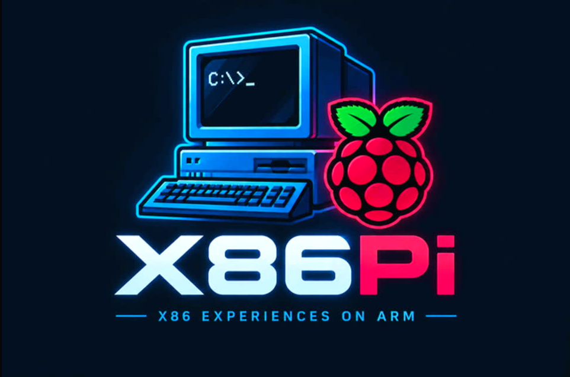
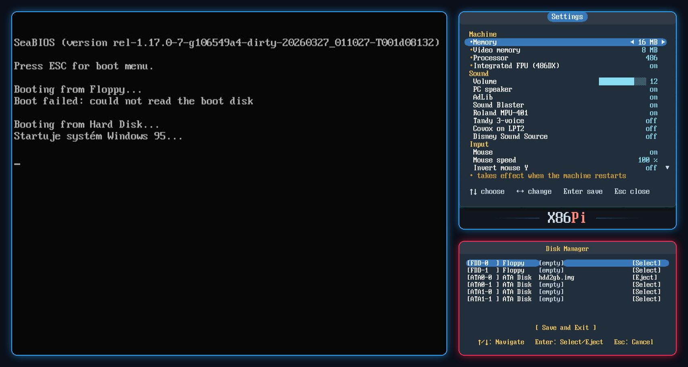

<p align="center">
  
</p>

<h1 align="center">X86Pi</h1>

<p align="center">
  <b>Almost bare-metal x86 on Pi</b><br>
  A 386 / 486 / Pentium-class PC that boots straight from the SD card of a Raspberry Pi 3 -
  no Linux underneath, just the emulator, the hardware and four ARM cores.
</p>

<p align="center">
  <a href="../../releases/latest"></a>
  <a href="LICENSE"></a>
  
</p>

<p align="center">
  
</p>

---

## What it is

X86Pi is a PC emulator that runs as the Raspberry Pi's operating system. It is
built on the [Circle](https://github.com/rsta2/circle) bare-metal framework, so
the Pi goes straight into a BIOS POST about ten seconds after power-on: SeaBIOS
starts, the disk images on the SD card are the machine's drives, and a USB
keyboard and mouse, an HDMI screen and the Pi's own audio outputs are its
peripherals.

The CPU and device models come from [Tiny386](https://github.com/hchunhui/tiny386)
by Chunhui He, by way of [FRANK 386](https://github.com/rh1tech/frank-386), which
put it on RP2350 microcontrollers. X86Pi takes it to the Raspberry Pi and spends
the extra headroom on fidelity: a real OPL3, a General MIDI synthesiser, VESA
graphics, networking, real USB floppy and CD drives, and a case front panel.

It boots MS-DOS and **Windows 95**, and runs DOS games with sound.

## Features

### Machine
- **CPU**: i386 interpreter with 486 and Pentium personalities - CPUID and the
  instruction set follow the chosen generation.
- **FPU**: x87 coprocessor, selectable as a 387 beside a 386 or as a 486SX/DX, and
  always present on a Pentium.
- **Memory**: 1 MB to 256 MB, offered per generation as a board of the time would
  have taken it.
- **Chipset**: SeaBIOS with a VGA BIOS, PCI bus, CMOS, PIC, PIT, DMA and keyboard
  controller. Ctrl+Alt+Del reboots.
- **Real-time clock**: the CMOS clock runs, and with a DS3231 module fitted it keeps
  the time across power cycles; a time set in DOS or Windows is written back to the
  module.
- **Power**: Windows' *Shut down* switches the machine off; the power button switches
  it on again.

### Graphics
- VGA text and graphics modes with CGA/EGA compatibility, Mode X and the split screen.
- **VESA / VBE** linear framebuffer modes with 256 KB to 8 MB of video memory.
- Output at 1920x1080 over HDMI, with the guest's picture scaled into it.
- The display is drawn on its own CPU core, so the emulated CPU never waits for it.

### Sound
Every device is mixed together and plays from **HDMI and the 3.5 mm jack at the same time**.

| Device | Notes |
|---|---|
| PC speaker | |
| AdLib / OPL3 | A YMF262 emulated by [Nuked OPL3](https://github.com/nukeykt/Nuked-OPL3) on its own core, for OPL2 and OPL3 software alike; register writes are time-stamped so that notes land where the game put them |
| Sound Blaster 16 | 8- and 16-bit DMA playback, single-cycle and auto-init, at 220h / IRQ 5 |
| Roland MPU-401 + General MIDI | MPU-401 UART at 330h driving a SoundFont synthesiser ([TinySoundFont](https://github.com/schellingb/TinySoundFont) with [GeneralUser GS](https://github.com/mrbumpy409/GeneralUser-GS)) on its own core, 128 voices |
| Tandy 3-voice | SN76489 |
| Covox | Speech Thing on LPT2 |
| Disney Sound Source | |

### Storage
- **Hard disks**: up to four ATA disk images on the SD card, on two IDE channels.
- **CD-ROM**: ATAPI drive for `.iso` images.
- **Floppies**: two drives for floppy images.
- **Real USB floppy drive**: a USB diskette drive becomes drive A and reads and writes
  real diskettes.
- **Real USB CD-ROM drive**: a USB CD/DVD drive becomes an ATAPI drive.
- What the guest writes goes straight into the image on the card, synced at the end
  of every write command.

### Input and network
- USB keyboard and USB mouse (emulated as PS/2), with adjustable mouse speed and
  inverted Y.
- **NE2000** network card at 300h / IRQ 3, bridged onto the Pi's own Ethernet port.

### On-screen menus
- **Win+F11 - Settings**: memory, video memory, processor, FPU, volume, every sound
  device, the mouse, and the power behaviour. Saved to `386/config.ini`.
- **Win+F12 - Disk manager**: insert and eject floppy, hard disk and CD images, or a
  USB floppy drive, while the machine runs.

### Front panel and real-time clock (optional)
- **Power button, reset button, power LED and HDD LED** on the GPIO header, wired
  like a PC case's front panel.
- The power button works like an ATX one: switching off blanks the screen, mutes the
  sound and waits for the button; switching on is a cold start. The settings menu
  chooses what happens when the board gets power back (*stay off*, *power on*, *last
  state*) and whether a press or only a four-second hold switches it off.
- **DS3231** real-time clock module on I2C.

Nothing has to be fitted: without the module the clock starts from the build time,
and pins with nothing on them do nothing.

### Under the hood
- All four Cortex-A53 cores work: the x86 CPU on core 0, the OPL3 and the sound
  mixer on core 1, the display on core 2, the General MIDI synthesiser on core 3.
  Idle cores sleep.
- Circle's CPU throttle starts at 80 °C instead of 60 °C.

## What you need

- A **Raspberry Pi 3** (developed and tested on a Pi 3; the image is built for
  Circle's `RASPPI=3`, which also covers the 3B+).
- A microSD card formatted **FAT32** or **exFAT** - a large cluster size (32-64 KB)
  makes the disk images faster.
- An HDMI screen, a USB keyboard and a USB mouse.
- A disk image with an operating system. X86Pi does not ship one.
- Optional: a DS3231 module, front panel buttons and LEDs, a USB floppy or CD drive,
  an Ethernet cable.

## Getting started

1. Download `x86pi-sdcard-*.zip` from the [latest release](../../releases/latest).
2. Unpack it onto the root of the SD card.
3. Copy your disk images into the card's `386` folder and name the boot disk in
   `386/config.ini` (`hda=` for a hard disk, `fda=` for a floppy) - or start without
   one and choose it with **Win+F12**.
4. Put the card in the Pi and power it on.

The card then looks like this:

```
/
├── bootcode.bin, start.elf, fixup.dat   Raspberry Pi firmware
├── LICENCE.broadcom
├── config.txt                           Pi boot configuration (1080p HDMI)
├── kernel8.img                          X86Pi
└── 386/
    ├── config.ini                       the machine
    ├── bios.bin, vgabios.bin            SeaBIOS and its VGA BIOS
    ├── gm.sf2, gm.sf2.LICENSE.txt       General MIDI SoundFont
    └── *.img, *.iso                     your disks
```

### Keys

| Keys | Action |
|---|---|
| Win+F11 | Settings menu |
| Win+F12 | Disk manager |
| Ctrl+Alt+Del | Reboot the guest |
| Arrows, Enter, Esc | Inside the menus: move and change, save, close |

### `386/config.ini`

```ini
[pc]
mem=16M            ; guest memory
vga_mem=8192K      ; video memory, 256K-8192K
cpu=4              ; 3 = 386, 4 = 486, 5 = Pentium
fpu=1
bios=bios.bin
vga_bios=vgabios.bin
hda=hdd.img        ; hda/hdb: hard disks on the first IDE channel
fda=floppy.img     ; fda/fdb: floppy drives

[X86Pi]
volume=12          ; 0-16
pcspeaker=1
adlib=1
soundblaster=1
mpu401=1
tandy=0
covox=0
dss=0
mouse=1
mouse_invert_y=0
mouse_speed=100    ; percent
power_restore=1    ; 0 stay off, 1 power on, 2 last state
power_button=0     ; 1 = hold four seconds to switch off
```

CD images, the second IDE channel and USB floppy drives are chosen in the disk
manager. The General MIDI synthesiser starts when `gm.sf2` is present, and any
General MIDI SoundFont can take its place.

### Windows 95

Windows 95 installs and runs, and finds the Sound Blaster 16 by itself. For General
MIDI, add the MPU-401 through *Control Panel → Add New Hardware* (select the hardware
yourself: *Sound, video and game controllers*, Microsoft, *Standard MPU-401*, I/O
330h, IRQ 9) and choose it under *Multimedia → MIDI*.

## Wiring

All of it is optional. Pin numbers are the physical pins of the 40-pin header.

**Front panel** - buttons to ground (the Pi's internal pull-ups are used), LEDs from
the GPIO to ground. Give each LED its own series resistor of 330 Ω-1 kΩ: a
motherboard header has one built in, a GPIO pin does not.

| Pin | Signal |
|---|---|
| 29 | GPIO5 - power button |
| 30 | GND - buttons |
| 31 | GPIO6 - reset button |
| 32 | GPIO12 - power LED (+) |
| 33 | GPIO13 - HDD LED (+) |
| 34 | GND - LEDs (-) |

**DS3231 real-time clock** - on I2C1, address 68h.

| Pin | Signal |
|---|---|
| 1 | 3.3 V - VCC |
| 3 | GPIO2 - SDA |
| 5 | GPIO3 - SCL |
| 6 | GND |

**Serial console** (development builds only) - PL011 on GPIO14 TX (pin 8) and GPIO15
RX (pin 10), 115200 8N1.

## Building

The build runs in Docker, so Docker is all the host needs.

```sh
git clone https://github.com/AidenShaw2020/x86pi.git
cd x86pi
docker build -t x86pi-build platform/circle
docker run --rm -v "$PWD":/src -w /src x86pi-build \
    sh -c "sh platform/circle/fetch-circle.sh && sh platform/circle/build.sh PC=1 NOUART=1"
```

In PowerShell write `${PWD}` for `$PWD`; in Git Bash put `MSYS_NO_PATHCONV=1` in
front of `docker run`.

The result is `platform/circle/kernel8-pc.img`; copy it to the card as `kernel8.img`.

- `fetch-circle.sh` clones Circle at the revision the build is pinned to. `build.sh`
  then applies X86Pi's changes to it - multi-core support, FatFs fast seek, the
  framebuffer's memory type, the throttle temperature, and the USB floppy, CD and hub
  drivers in [`platform/circle/patches`](platform/circle/patches) - and builds the
  libraries and the kernel.
- `NOUART=1` switches the serial console off, as a card for playing should have it:
  a log line on a polled UART takes the machine away from the guest for as long as it
  takes to send. Leave it out for a development build.
- `STATS=1` adds periodic performance, audio and per-core statistics to the console.

[`platform/circle/README.md`](platform/circle/README.md) describes the development
tools.

## Credits

X86Pi stands on the work of these projects and people:

- **[Tiny386](https://github.com/hchunhui/tiny386)** - Chunhui He. The i386 CPU,
  x87 FPU and PC device models. BSD 3-Clause. Tiny386 in turn builds on:
  - device models from [QEMU](https://www.qemu.org/) and
    [TinyEMU](https://bellard.org/tinyemu/) - Fabrice Bellard (8042 keyboard
    controller, 8254 PIT, 8259 PIC, IDE, NE2000, PCI, VGA), Vassili Karpov (AdLib,
    8257 DMA, Sound Blaster 16), Joachim Henke (PC speaker). MIT.
  - [SeaBIOS](https://www.seabios.org/) - Kevin O'Connor and contributors. LGPL-3.0.
- **[FRANK 386](https://github.com/rh1tech/frank-386)** ([frank.rh1.tech](https://frank.rh1.tech/)) -
  Mikhail Matveev, DnCraptor, Mike Vengerovich. Tiny386 on RP2350 boards, with the
  on-screen disk manager, the Tandy, Covox and Disney Sound Source devices and much of
  the device work X86Pi continues from. MIT. FRANK 386 in turn credits:
  - [Pico-286](https://github.com/xrip/pico-286) - xrip. MIT.
  - [QuakeGeneric](https://github.com/DnCraptor/quakegeneric) - DnCraptor. GPL-2.0.
  - [FatFs](http://elm-chan.org/fsw/ff/) - ChaN. FatFs licence.
  - [Pico SDK](https://github.com/raspberrypi/pico-sdk) - Raspberry Pi Ltd. BSD 3-Clause.
- **[Circle](https://github.com/rsta2/circle)** - Rene Stange. The bare-metal framework
  X86Pi runs on, with its USB, SD card, FatFs, audio and multi-core support. GPL-3.0.
- **[Nuked OPL3](https://github.com/nukeykt/Nuked-OPL3)** - Nuke.YKT. The OPL3.
  LGPL-2.1-or-later.
- **[TinySoundFont](https://github.com/schellingb/TinySoundFont)** - Bernhard
  Schelling. The SoundFont synthesiser. MIT.
- **[GeneralUser GS](https://github.com/mrbumpy409/GeneralUser-GS)** - S. Christian
  Collins. The General MIDI SoundFont. GeneralUser GS licence v2.0.
- **[inih](https://github.com/benhoyt/inih)** - Ben Hoyt. The INI parser. BSD 3-Clause.
- **Raspberry Pi firmware** - Broadcom Corporation and Raspberry Pi Ltd.
  Redistributable binary licence in `sdcard/LICENCE.broadcom`.

The screenshots show SeaBIOS (© Kevin O'Connor and contributors, LGPL-3.0) and X86Pi's
own menus. Windows is a trademark of Microsoft Corporation.

## License

The firmware links Circle, which is GPL-3.0, so X86Pi as a whole - the source in this
repository and the `kernel8.img` built from it - is distributed under the
**[GNU General Public License v3.0](LICENSE)** or later.

Files that carry their own licence notice keep it, and each of those licences is
compatible with the GPL: FRANK 386's sources are MIT
([`LICENSES/frank-386.txt`](LICENSES/frank-386.txt), which also carries Tiny386's BSD
3-Clause text), the QEMU-derived device models MIT, Nuked OPL3 LGPL-2.1-or-later
([`src/nuked/LICENSE`](src/nuked/LICENSE)), TinySoundFont MIT (in
[`src/tsf/tsf.h`](src/tsf/tsf.h)), inih BSD 3-Clause, and Circle's files in
`platform/circle/patches` GPL-3.0.

The SD card files are redistributed under their own terms: `bios.bin` and
`vgabios.bin` are SeaBIOS and SeaVGABIOS builds (LGPL-3.0, source at
[seabios.org](https://www.seabios.org/)) as distributed by FRANK 386; `gm.sf2` is
GeneralUser GS 2.0.3 (`sdcard/386/gm.sf2.LICENSE.txt`); the Raspberry Pi firmware is
under `sdcard/LICENCE.broadcom`.
